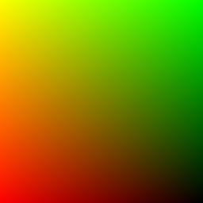

# Volume Rendering and Neural Radiance Fields

**Note**:  I completed this project as a part of the course CMSC848F - 3D Vision, Fall 2023, at the University of Maryland. The original tasks and description can be found at https://github.com/848f-3DVision/assignment3 

**Goals**: In this project, we implement a simple volumetric renderer, with the help of which we implement a Neural Radiance Field (NeRF) for implicit 3D representation and novel view synthesis.
 
**Results**: All the results and inferences from this project can be found in this webpage : https://shyam-pi.github.io/Volume-Rendering-and-Neural-Radiance-Fields/

##  0. Setup

### 0.1 Environment setup
You can setup the python evironment with the `environment.yml` file:

```bash
conda env create -f environment.yml
conda activate l3d
```

### 0.2 Data

The data for this assignment is provided in the github repo under `data/`. You do not need to download anything yourself.

##  1. Differentiable Volume Rendering

In the emission-absorption (EA) model , volumes are typically described by their *appearance* (e.g. emission) and *geometry* (absorption) at *every point* in 3D space. Firstly we implement a ***Differentiable Renderer*** for EA volumes, which we will use in the NeRF formulation as well. Differentiable renderers are extremely useful for 3D learning problems --- one reason is because they allow one to optimize scene parameters (i.e. perform inverse rendering) from image supervision only!

##  1.1. Code structure

There are four major components of our differentiable volume rendering pipeline:

* ***The camera***: `pytorch3d.CameraBase`
* ***The scene***: `SDFVolume` in `implicit.py`
* ***The sampling routine***: `StratifiedSampler` in `sampler.py`
* ***The renderer***: `VolumeRenderer` in `renderer.py`

`StratifiedSampler` provides a method for sampling multiple points along a ray traveling through the scene (also known as *raymarching*). Together, a sampler and a renderer describe a rendering pipeline. Like traditional graphics pipelines, this rendering procedure is independent of the scene and camera.

The scene, sampler, and renderer are all packaged together under the `Model` class in `main.py`. In particular the `Model`'s forward method invokes a `VolumeRenderer` instance with a sampling strategy and volume as input.

The `RayBundle` class in `ray_utils.py`, which provides a convenient wrapper around several inputs to the volume rendering procedure per ray.

##  1.2. Outline of tasks

In order to perform rendering, we have implemented the following routines:

##  1.3. Ray sampling

The `render_images` function in `main.py` loops through a set of cameras, generates rays for each pixel on a camera, and renders these rays using a `Model` instance.

The `get_pixels_from_image` method generates pixel coordinates, ranging from `[-1, 1]` for each pixel in an image. The `get_rays_from_pixels` method generates rays for each pixel, by mapping from a camera's *Normalized Device Coordinate (NDC) Space* into world space.

### Visualization

One can run the code for ray sampling with:

```bash
python main.py --config-name=box
```

The output should be similar to the below images:

    

##  1.4. Point sampling

The next component is the `StratifiedSampler` in `sampler.py`. We have implemented the forward method, which:

1. Generates a set of distances between `near` and `far` and
2. Uses these distances to sample points offset from ray origins (`RayBundle.origins`) along ray directions (`RayBundle.directions`).
3. Stores the distances and sample points in `RayBundle.sample_points` and `RayBundle.sample_lengths`

### Visualization

Use the `render_points` method in `render_functions.py` in order to visualize the point samples from the first camera. They should look like this:


##  1.5. Volume rendering

Finally, we can implement volume rendering! With the `configs/box.yaml` configuration, we have an `SDFVolume` instance describing a box. The code for this function in `implicit.py`, which converts a signed distance function into a volume. If you want, you can even implement your own `SDFVolume` classes by creating new signed distance function class, and adding it to `sdf_dict` in `implicit.py`. Take a look at [this great web page](https://www.iquilezles.org/www/articles/distfunctions/distfunctions.htm) for formulas for some simple/complex SDFs.


### Implementation

The following equation is used to render color along a ray:


where `σ` is density, `Δt` is the length of current ray segment, and `L_e` is color:


The weights `T * (1 - exp(-σ * Δt))` are computed in `VolumeRenderer._compute_weights`, and the summation is performed in `VolumeRenderer._aggregate`

Use weights, and aggregation function to render *color* and *depth* (stored in `RayBundle.sample_lengths`). 

### Visualization

The visualization for spiral rendering of this implicit volume and its corresponding depth will be as shown below

 


##  2. Optimizing a basic implicit volume

##  2.1. Random ray sampling

We can use the differentiable volume renderer to optimize the parameters of a volume! The basic training loop can be found in `train` method in `main.py`.

Depending on how many sample points we take for each ray, volume rendering can consume a lot of memory on the GPU (especially during the backward pass of gradient descent). Because of this, it usually makes sense to sample a subset of rays from a full image for each training iteration. In order to do this, we have implemented the `get_random_pixels_from_image` method in `ray_utils.py`


##  2.2. Loss and training (5 points)

Mean squared error between the predicted colors and ground truth colors `rgb_gt` is the loss function.

You can run train a model with
```bash
python main.py --config-name=train_box
```

This will optimize the position and side lengths of a box, given a few ground truth images with known camera poses (in the `data` folder).

##  2.3. Visualization

The code renders a spiral sequence of the optimized volume in `images/part_2.gif` which must look like the following


##  3. Optimizing a Neural Radiance Field (NeRF)
In this part, we implement an implicit volume as a Multi-Layer Perceptron (MLP) in the `NeuraRadianceField` class in `implicit.py`. This MLP maps 3D position to volume density and color. Specifically the MLP takes in a `RayBundle` object in its forward method, and produce color and density for each sample point in the RayBundle.

We then use this implicit volume to optimize a scene from a set of RGB images.

## Implementation

Here are a few things to note:

1. For now, the NeRF MLP does not handle *view dependence*, and solely depends on 3D position.
2. The `ReLU` activation is used to map the first network output to density (to ensure that density is non-negative)
3. `Sigmoid` activation is used to map the remaining raw network outputs to color
4. *Positional Encoding* of the input is used in the network to achieve higher quality. Implementation of positional encoding can be found in the `HarmonicEmbedding` class in `implicit.py`.

## Visualization
You can train a NeRF on the lego bulldozer dataset with

```bash
python main.py --config-name=nerf_lego
```

This will create a NeRF with the `NeuralRadianceField` class in `implicit.py`, and use it as the `implicit_fn` in `VolumeRenderer`. It will also train a NeRF for 250 epochs on 128x128 images.

Feel free to modify the experimental settings in `configs/nerf_lego.yaml` --- though the current settings should allow you to train a NeRF on low-resolution inputs in a reasonable amount of time. After training, a spiral rendering will be written to `images/part_3.gif`. The result of this should look like this :


